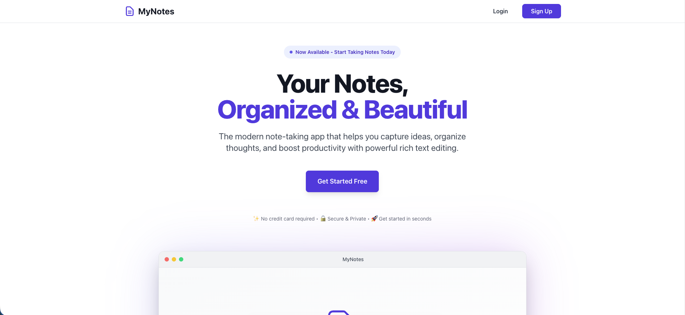

# MyNotes - Personal Knowledge Base

MyNotes is a clean, modern, and persistent note-taking application built with **Laravel** (Backend) and **React** (Frontend). It allows you to organize your thoughts into Books and Pages with a rich text editor.



## Features

*   **Book & Page Organization**: Create books (folders) and unlimited pages within them.
*   **Rich Text Editor**: Formatting, lists, and headers support.
*   **Authentication**: Secure Signup/Signin with JWT (JSON Web Tokens).
*   **Responsive Design**: Built with Tailwind CSS for mobile and desktop.
*   **Auto-Installer**: Built-in web installer for easy deployment on shared hosting.

## Technology Stack

*   **Backend**: PHP 8.2+, Laravel 11
*   **Frontend**: React 18, Vite
*   **Database**: MySQL
*   **Styling**: Tailwind CSS

## Requirements

*   PHP >= 8.2
*   Composer
*   Node.js & NPM (for development)
*   MySQL Database

## Installation

### Option 1: Development Setup (Source Code)

1.  **Clone the repository:**
    ```bash
    git clone https://github.com/yourusername/mynotes.git
    cd mynotes
    ```

2.  **Install PHP Dependencies:**
    ```bash
    composer install
    ```

3.  **Install Frontend Dependencies & Build:**
    ```bash
    cd frontend
    npm install
    npm run build
    cd ..
    ```

4.  **Environment Setup:**
    ```bash
    cp .env.example .env
    php artisan key:generate
    ```
    *   Set your database credentials in `.env` (`DB_DATABASE`, `DB_USERNAME`, etc).
    *   Set a `JWT_SECRET` (just a random string).

5.  **Run Migrations:**
    ```bash
    php artisan migrate
    ```

6.  **Serve:**
    ```bash
    php artisan serve
    ```
    Visit `http://localhost:8000`.

### Option 2: Production Deployment (Shared Hosting)

1.  Download the latest **Release Zip**.
2.  Upload the zip file to your server's `public_html` (or subfolder).
3.  Unzip the file.
4.  Open your browser and visit your site URL (e.g., `https://yourdomain.com`).
5.  You will be redirected to the **Installer**.
6.  Enter your database details and click **Install**.

## Credits

Developed by **Karan Khandekar**.
Development available at **[Wit Reach](https://witreach.github.io/)**.

## License

This project is open-sourced software licensed under the [MIT license](https://opensource.org/licenses/MIT).
